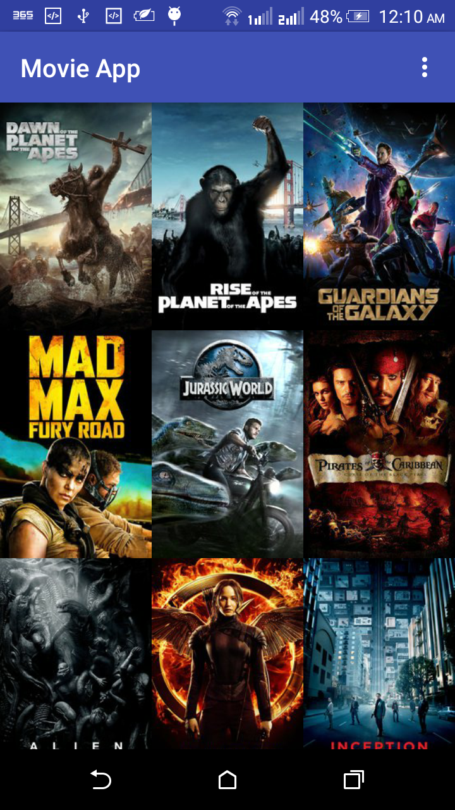
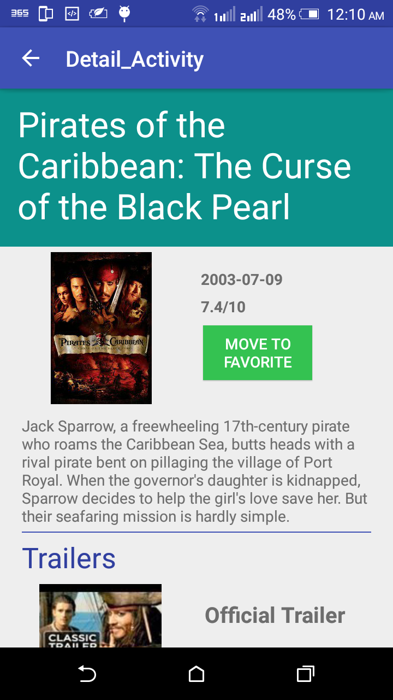
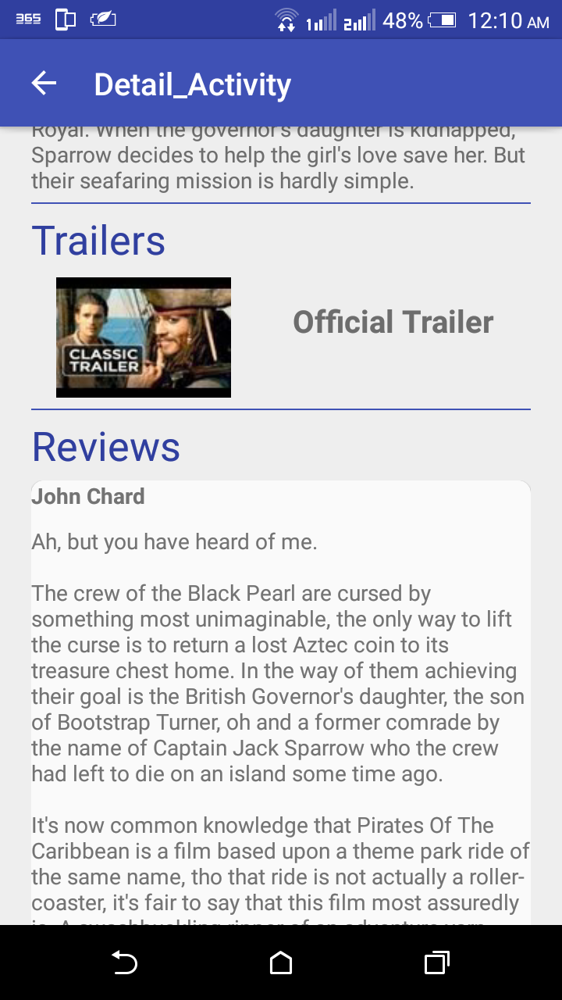

# MovieApp

Here is a fully functional and colorful android app which I made from scratch for Android Developer Nanodegree program.
This app reveals the power of adaptive UI both for phone and tablet devices.

*Popular Movies* was highly evaluated by certified Udacity code reviewer and was graded as "Exceeds Specifications".

## Features

With the app, you can:
* Discover the most popular, the most rated or the highest rated movies
* Save favorite movies locally to view them even when offline
* Watch trailers
* Read reviews

## How to Work with the Source

This app uses [The Movie Database](https://www.themoviedb.org/documentation/api) API to retrieve movies.
You must provide your own API key in order to build the app. When you get it, just paste it to:
    ```
    app/build.gradle
    ```

## Screens



